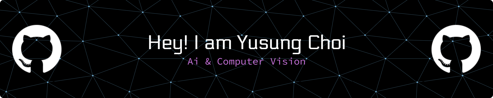

  

# 🌟 Yusung Choi's Academic Portfolio

Hello! 👋 I am an undergraduate student passionate about Artificial Intelligence (AI) and Computer Vision.
This repository serves as a portfolio documenting my research, competition experiences, and paper reviews.

  
  
  
  
  
  
  

---

## 📁 Repository Structure

- **📝 publications/**  
  A collection of research papers I have written and submitted to conferences/journals.

- **🏆 competitions/**  
  Solutions and results from Kaggle, Dacon, and other AI competitions
  includes awards, reflections, and ideas for further improvement.
  
- **📚 paper-reviews/**  
  Summaries of papers I have read, highlighting the core ideas and my personal insights.

- **🧠 algorithm-study/**  
  Notes from studying algorithms and coding interview problems.
  Contains solutions, strategies, and error analyses.
---

## 📬 Contact

- Email: cyscyb@gmail.com
- GitHub: [github.com/yusungchoi](https://github.com/yusungchoi)  
- Kaggle: [kaggle.com/yusungchoi](https://kaggle.com/yusungchoi)  
- Dacon: [dacon.io/smileeeeee](https://dacon.io/profile/smileeeeee)

---

⚡ This portfolio is continuously updated as I progress in my research and learning journey.
