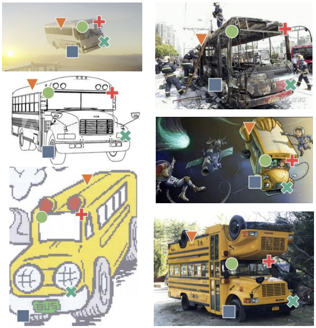
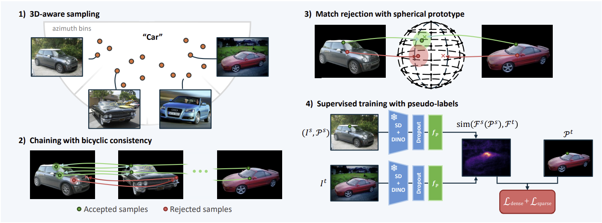
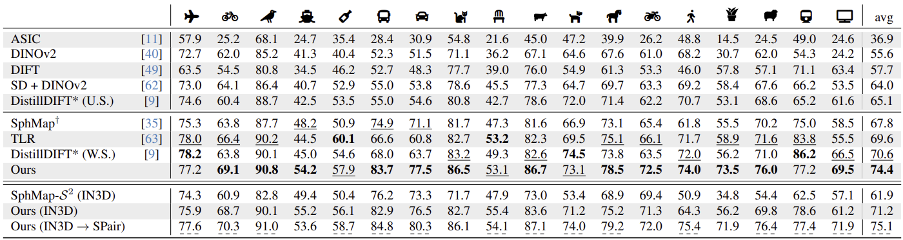

## 📄 논문 정리: Do It Yourself: Learning Semantic Correspondence from Pseudo-Labels

  
   
  출처: Olaf Dünkel, DIY-SC, arXiv preprint

> 논문 링크: https://arxiv.org/pdf/2506.05312
> 
> 발표 학회/연도: arXiv preprint
> 
> 논문 저자: Olaf Dünkel, Thomas Wimmer, Christian Theobalt, Christian Rupprecht, Adam Kortylewski
 

**해당 논문 선택 이유**
semantic correspondence matching에서의 키포인트 라벨없이 시맨틱 대응을 학습하는 방식이 참신하다고 느꼈기에 다음 논문을 선택하였습니다

---

### 이 논문의 핵심 아이디어는 무엇인가?
DIY-SC는 라벨이 전혀 없는 상태에서도 3D-aware pseudo-label을 생성하여 
시맨틱 대응(Semantic Correspondence)을 학습하는 완전한 self-supervised 프레임워크이다
핵심은 “이미 존재하는 3D priors를 이용해 pseudo correspondence를 스스로 만들어내는 자급자족 학습 구조”로,
supervised SC 모델들이 필요로 하던 키포인트 라벨 없이도, spherical prototype representation과 
relaxed cycle-consistency loss를 통해 일관된 대응을 학습한다

### 이 연구가 중요한 이유는 무엇인가?
Semantic correspondence 연구의 최대 난제는 대규모 라벨 데이터셋 부재이다
기존에는 SPair-71k, PF-PASCAL 등 소규모 라벨 데이터셋에 의존해 학습했지만, 이는 일반화 성능과 도메인 확장성에 큰 제약을 두었다
DIY-SC는 pseudo-label 기반의 대규모 self-supervised 대응학습을 실현해,
라벨링 없이도 높은 정확도와 일관성을 달성하며, “semantic matching의 ImageNet”을 가능하게 할 방법론적 전환점을 제시했다

### 기존 연구들의 한계는 무엇인가?
- 수동 키포인트 라벨에 의존 --> 새로운 카테고리나 도메인으로 확장 어려움
- 2D correspondence의 불안정성 --> 깊이 및 뷰포인트 변화에 취약
  
### 그 한계를 어떻게 해결하였는가?
- 3D-Aware Pseudo-Label Generation
    - 3D priors와 semantic shape alignment를 이용해 view-invariant correspondence 생성
- Relaxed Cyclic Consistency Loss
    - 완벽한 순환 일치를 강제하지 않고, 불확실성이 높은 구간을 가중치로 완화
- Spherical Prototype Representation
    - 동일 객체 내 반복 구조나 좌우 대칭 문제를 해결하며 global-consistent 매핑 확보

### 제안 방법의 구조는 어떤가?

  

   출처: Olaf Dünkel, DIY-SC, arxiv preprint 

DIY-SC는 라벨 없이 3D priors로 의사라벨을 만들고, 이를 반복적으로 정제해 학습하는 **self-supervised correspondence** 방법이다

1) 3D-Aware Pseudo-Label Generation
  - 뷰포인트 주석 또는 ImageNet-3D의 3D pose를 이용해 viewpoint proximity sampling + K-step chaining으로 쉬운 쌍→어려운 쌍 순서로 의사라벨을 전파.
  - 결과적으로 view-invariant correspondence를 확보하고, 이 의사라벨을 self-supervision으로 사용.

2) Relaxed Cyclic Consistency Loss
  - 순환일치: $p_s \rightarrow p_t \rightarrow \hat{p}_s$가 정확히 같지 않아도 반경 max안으로 들어오면 괜찮음
  - 완전 강제 대신 완화(soft) 제약으로 잡음 라벨을 덜어내고 학습을 안정화.

3) Spherical Prototype Representation (SPM)
  - 픽셀 특징을 단위 구면 $S^2$ 상 canonical 좌표로 사상해, 물체 내 global-consistent 위치를 정규화.
  - 좌/우 대칭이나 반복부품에서 생기는 모호성을 줄이고, 구면 각도 거리 $\theta < \theta_{th}$ 기준으로 false match를 거절
$p_s \rightarrow p_t \rightarrow \hat{p}_s$
4) Training Objective (요약)

$$
\mathcal{L}_{total} \;=\;
\lambda_1 \,\mathcal{L}_{\text{sparse-contrastive}}
+\lambda_2 \,\mathcal{L}_{\text{dense-regression}}
+\lambda_3 \,\mathcal{L}_{\text{cyclic-consistency}}
$$

  - **Sparse contrastive**: 정답/오답 대응쌍 간 특징 대비를 키움.
  - **Dense regression**: 윈도우 soft-argmax로 연속 좌표 정합(희소 지도 보완).
  - **Cyclic consistency**: 의사라벨의 일관성 유지(완화 반경 $r_{\max}$).

5) Inference
  - 학습된 adapter $f_p$만 사용하여 DINOv2 특징을 정제한 뒤, NN 매칭 + soft-argmax로 좌표를 추정.
  - 테스트 시 3D priors/구면 매퍼 같은 의사라벨 생성 모듈은 사용하지 않음

### 어떤 성과를 얻었는가?

  

   출처: Olaf Dünkel, DIY-SC, arxiv preprint 

- SPair-71k 및 PF-PASCAL에서 SOTA self-supervised 성능 기록
- DINOv2 baseline 대비 PCK@0.1 약 +4.2% 향상
- pseudo-label 생성 품질 측면에서도 기존 self-consistency 기반보다 더 안정적인 대응 품질 달성
  
### 어떤 데이터를 사용했는가?
- SPair-71k: 다양한 카테고리(자동차, 동물 등), viewpoint/scale 변화 포함
- ImageNet-3D: 약 86k 이미지의 객체 중심 3D 포즈 주석
- AP-10K: 10,000+ 동물 이미지, 풍부한 키포인트 어노테이션

### 비판적 읽기 & 한계점은 무엇인가?
- 뒤집힌 자세·극단 자세에서 실패: 저자들이 직접 “거꾸로 뒤집힌 물체” 등 일부 어려운 경우에 여전히 실패한다고 명시
- 구면 프로토타입(spherical mapper)의 표현 한계: 구면으로 잘 표현되지 않는 물체(에선 효과가 약해진다고 스스로 한계를 밝힘
- 약감독 축소 과제 미해결: 현재도 마스크(SAM/대체), 포즈(방위각 bin 또는 IN3D의 자세) 같은 약한 감독,프라이어가 필요하고, 이를 더 줄이는 방향이 필요하다고 말함
  
### 한줄 요약 및 개인적 생각
- DIY-SC는 3D-aware pseudo supervision으로 라벨 없는 시맨틱 대응의 문을 연 연구다
Weak supervised, Self superviesd쪽에 큰 가능성을 보았으며 더 많은 supervised 방식을 찾아보고 적용해볼 예정이다
