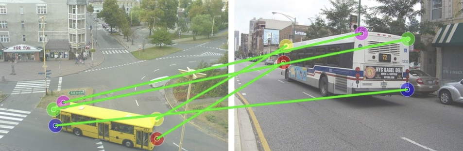
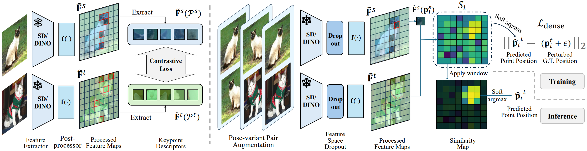
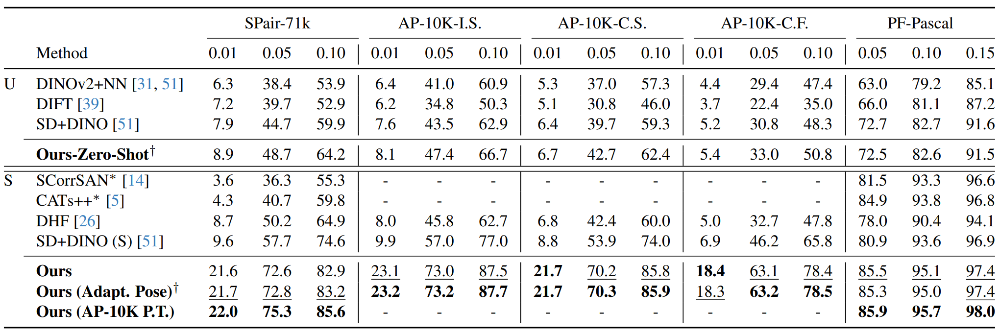

## 📄 논문 정리: PointNet — Deep Learning on Point Sets for 3D Classification and Segmentation

  
<p align="center">
  <span> 출처: Junyi Zhang, GeoAware-SC, CVPR 2024 </span>
</p>

> 논문 링크: https://arxiv.org/abs/2311.17034 
> 
> 발표 학회/연도: CVPR 2024
> 
> 논문 저자: Junyi Zhang, Charles Herrmann, Junhwa Hur, Eric Chen, Varun Jampani, Deqing Sun, Ming-Hsuan Yang
<br>

**해당 논문 선택 이유**
Semantic Correspondence는 두 이미지 간 의미적으로 대응되는 부분을 정확히 찾는 것을 목표로 하지만, 기존 방법들은 “왼쪽 발 - 오른쪽 발”처럼 **기하학적 모호성(geometry ambiguity)** 이 존재할 때 취약했습니다.
GeoAware-SC는 이 문제를 간단하지만 효과적인 방법으로 해결하여 좌/우, 앞/뒤를 구분할 수 있는 correspondence를 가능하게 했습니다
백본을 바꾸지 않고 후처리 모듈과 추론 전략만으로 성능을 크게 개선한 점이 흥미로워 선택하게 되었습니다

---

### 이 논문의 핵심 아이디어는 무엇인가?
- **기하학적 인식(Geometry-awareness)**을 Semantic Correspondence의 새로운 관점으로 정의
- 기존 FOundation Model (DINOv2, Stable Diffusion) 피처를 그대로 사용하되,
  - 경량 후처리 모듈(Post-processor) 학습
  - Soft-argmax 기반 Dense Training
  - Pose-variant Augmentation (Train)
  - Adaptive Pose Alignment (Test)
  - Window Soft-argmax를 도입
    
### 이 연구가 중요한 이유는 무엇인가?
- Semantic Correspondence는 이미지 편집, 스타일 전이, 3D 재구성 등 수많은 downstream task의 기반이다
- 기존 연구들은 “비슷한 부분 찾기”에는 강했지만, 방향·위치 구분은 잘 못했었다
- GeoAware-SC는 geometry-aware subset에서 큰 성능 향상을 보여, 실제 활용성을 크게 높였다
  
### 기존 연구들의 한계는 무엇인가?
- Foundation Model 기반 SC는 semantic-level 대응은 잘하지만 기하학적 모호성에서는 실패
- Argmax 기반 매칭은 서브픽셀 정밀도 부족 + 노이즈 취약
- Train-time 데이터 증강은 crop, 색변화 등 --> geometry 인식에는 도움 미미
  
### 그 한계를 어떻게 해결하였는가?
- Dense Training Objective: soft-argmax 기반 손실로 gradient를 공간 전체로 확산
- Pose-variant Augmentation: train-time에 좌우 flip, rotation 적용
- Adaptive Pose Alignment: test-time에 source를 여러 pose로 변환 → IMD 최소 버전 선택
- Window Soft-argmax: local window 내에서 soft-argmax 적용 --> 서브픽셀 정밀도 + 강건성 확보
  
### 제안 방법의 구조는 어떤가?

<p align="center">
  <br>
  <span> 출처: Junyi Zhang, GeoAware-SC, CVPR 2024</span>
</p>

**Backbone**: DINOv2 + Stable Diffusion (freeze)  
**Post-processor**: 4-layer bottleneck (약 5M params) → geometry-aware feature 정제  

**Training** 
  1. Source/Target → Backbone → Fused feature
  2. Post-processor 학습 (Backbone은 freeze)
  3. Loss = Sparse contrastive + Dense soft-argmax
  4. Pose-variant augmentation (flip/rotation) 적용

**Inference**
  1. Source를 여러 pose로 변환 (none, flip, rot)
  2. 각 후보와 Target 간 IMD 계산 → 최소 후보 선택
  3. 선택된 feature로 similarity map 계산
  4. Window soft-argmax → 정밀 correspondence 좌표 산출

### 어떤 성과를 얻었는가?

<p align="center">
  <br>
  <span> 출처: Junyi Zhang, GeoAware-SC, CVPR 2024</span>
</p>

- SPair-71k:
  - Zero-shot: +5.5% PCK@0.1 ↑
  - Supervised: +11% PCK@0.1 ↑
- AP-10K (동물 포즈):
  - 더 큰 규모, cross-species 매칭 가능 → 기존 방법 대비 큰 향상
- 특히 geometry-aware subset에서 성능 차이가 확연히 개선됨
  
### 어떤 데이터를 사용했는가?
- SPair-71k: 다양한 카테고리(자동차, 동물 등), viewpoint/scale 변화 포함
- AP-10K: 10,000+ 동물 이미지, 풍부한 키포인트 어노테이션
- Geometry-aware subset 정의: 같은 의미 그룹 내에서 여러 키포인트가 존재할 때
  
### 비판적 읽기 & 한계점은 무엇인가?
- 장점:
  - 새로운 백본 없이 단순 모듈/전략만으로 geometry-aware robustness 확보
  - 실험적으로 “pose variation --> 성능 저하” 원인을 명확히 규명
  - 실제 downstream task에 바로 적용 가능
- 한계:
  - 여전히 backbone 자체는 geometry-awareness 부족 --> post-processor 의존
  - Test-time augmentation(IMD 기반 pose alignment)은 실시간성 응용에서 latency 부담
  - Window Soft-argmax는 local refinement라 global context는 여전히 한계
- 개인적 생각:
  - 이 연구는 “backbone을 새로 만드는 것보다, 기존 foundation model의 약점 보완”에 초점을 둔 실용적 접근이지만 앞으로는 geometry-aware inductive bias를 가진 end-to-end backbone 연구와 연결될 필요가 보인다

### 직관적으로 구조 이해하기

```python
Train:
Image --> [SD,DINO freeze] --> fused feature --> Post-processor --> Dense+Sparse Loss

Test:
Src Image {none, flip, rot} --> [SD,DINO+Postproc] --> IMD --> Best Pose 선택 --> Similarity Map --> Window Soft-argmax --> Correspondence
```

### 궁금했던 부분
Q: Flip/rotation은 feature map에 적용했나?  
A: feature map에 적용한게 아닌, 이미지 레벨에서 변환 후 feature 추출했음  

Q: Zero-shot과 Supervised 차이는?  
A: Zero-shot은 backbone feature 그대로,Supervised는 SPair-71k로 post-processor 학습  

Q: 상하좌우 반전의 pose-variant augmentation을 적용했기때문에 Train 시간이 오래 걸렸을까?  
A: SD+DINO 고해상도 입력 때문에 무겁지만, backbone freeze + 작은 post-processor라 상대적으로 오랜 시간이 걸리진 않았다  
