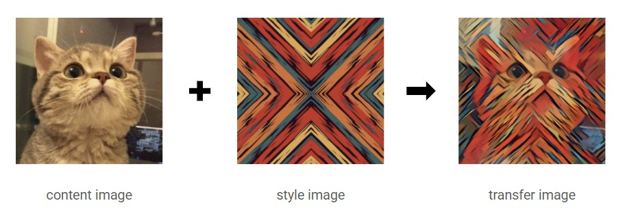
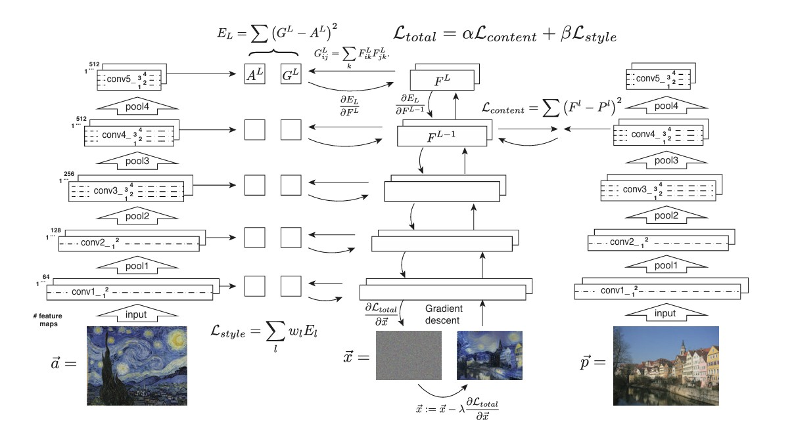

## 📄 논문 정리: Image Style Transfer Using Convolutional Neural Networks



> 논문 링크: https://arxiv.org/abs/1508.06576
> 
> 발표 학회/연도: CVPR 2016 (IEEE Conference on Computer Vision and Pattern Recognition)
> 
> 논문 저자: Leon A. Gatys, Alexander S. Ecker, Matthias Bethge
<br>

**해당 논문 선택 이유**  
제가 마음먹고 처음으로 읽은 논문입니다. 첫 논문 리뷰/구현/응용인 만큼 잘하고 싶은 생각이 앞섰습니다 CNN에 관심이 많고 해당 논문이 학부생이 구현하기에 난이도가 어렵지 않으며 코드 구현 후 실행했을 때 결과가 한눈에 보인다는 장점 때문에 논문 읽기에 흥미를 붙일 수 있을 것 같아 다음 논문을 선택하게 되었습니다!

---

### 이 논문의 문제/핵심 아이디어는 무엇인가?

- **문제** : 임의의 content 이미지의 구조는 유지하면서, style 이미지의 질감/붓터치/색체 통계를 가져다 붙여 새로운 이미지를 생성하는 것  
- **핵심 아이디어** : 객체 인식을 위해 최적화된 합성곱 신경망(Convolutional Neural Networks)에서 
유도된 이미지 표현을 사용하여 자연 이미지의 내용(content)와 스타일(style)을 
분리하고 결합할 수 있다 이를 통해 임의의 사진의 내용을 다양한 유명 예술작품의 
외형과 결합한 높은 지각적 품질을 가진 새로운 이미지를 생성해낼 수 있다는 아이디어이다


### 이 연구가 중요한 이유는 무엇인가?

- 기존의 연구에서는 전통적인 필터나 텍스처 합성 기법에 의존해왔다 
그에 반해 이 논문은 CNN(Convolutional Neural Network)을 이용하여 스타일과 콘텐츠를 분리하여
조합하하는 새로운 방법을 제안하였다  
- 기존 CNN은 인식용이라는 인식이 널리 퍼져있었는데 중간 feature가 '스타일/콘텐츠'를 분해해 표현한다는걸 보였다  
- 시각적 생성(generative) 작업에 분류 CNN을 활용하는 교차 영역 아이디어의 시초가 되었다


### 기존 연구의 한계는 무엇인가

- 기존 style transfer 방법들은 주로 비딥러닝 방법(수동적으로 필터나 텍스처 패턴을 조합하는 방식)으로 지역성 일관성은 괜찮았지만, multi scale, content 보존을 만족시키 어려워 스타일과 콘텐츠를 명확히 분리하지 못하였다


### 그 한계를 어떻게 해결하였는가?

- **스타일** : Gram Matrix라는 식을 사용 -> CNN의 낮은층은 엣지, 생상, 질감같은 저차원 특징을 high -level에서 패턴, 구조와 같은 고차원 특징을 찾아냄으로써 여러 층의 Gram maxtrix를 동시에 맞추어 다중 스케일의 질감을 한번에 재현하였다
- **Gram Matrix 정의** : $G^l_{ij} = \sum_{k} F^l_{ik} F^l_{jk}$
- **Content와 Style을 명확히 분리** : 콘텐츠 손실은 특정 한 층의 feature map 값 자체를 맞추는 방식, 스타일 손실은 여러 층에서 feature 간 상관을 맞추는 방식으로 정의해, 콘텐츠/스타일 간 충돌을 최소화했다
- **Content Loss** : $`\mathcal{L}_{\text{content}}(p,x,l) = \frac{1}{2} \sum_{i,j} \left( F^l_{ij}(x) - F^l_{ij}(p) \right)^2`$

- **Style Loss** : $E_l = \frac{1}{4 N_l^2 M_l^2} \sum_{i,j} \left( G^l_{ij}(x) - G^l_{ij}(a) \right)^2$

### 제안 방법의 구조는 어떤가?

새로운 네트워크를 설계하는 것이 아닌 사전학습된 VGG-19모델을 특징 추출기로 사용

1. 입력:
    - content 이미지 $`\mathcal{I}_{\text{c}}`$
    - style 이미지 $`\mathcal{I}_{\text{s}}`$
    - 초기 합성 이미지 (white noise) $`\mathcal{I}`$
2. VGG-19 특징 추출:
    - 모든 이미지의 동일 전처리(정규화, 사이즈 조정)
    - 콘텐츠 손실용 층(`conv4_2`)에서 feature 추출
    - 스타일 손실용 층(`conv1_1, conv2_1, conv3_1, conv4_1, conv5_1`)에서 feature 추출 -> Gram Matrix계산
3. 손실 계산:
    - 콘텐츠 손실 : $`\mathcal{I}`$ 와 $`\mathcal{I}_{\text{c}}`$ 의 콘텐츠 층 feature 차이 제곱합
    - 스타일 손실 : $`\mathcal{I}`$ 와 $`\mathcal{I}_{\text{s}}`$ 의 각 스타일 층 Gram Matrix 차이 제곱합
4. 최적화
    - 목표 : $`\mathcal{L}_{\text{total}}`$ 최소화
    - L-BFGS나 Adam으로 $`\mathcal{I}`$ 의 픽셀값 업데이트
5. 반복
    - 손실 수렴할때까지 or 정해진 step 수 만큼 반복
<br>

```math
\begin{aligned}
\textbf{Input:} & \quad \text{Content image } I_c,\; \text{Style image } I_s \\
\text{Initialize:} & \quad I \gets \text{noise or } I_c \\
\textbf{while not converged do:} & \\
& \quad \text{Extract } F^l(I),\; F^l(I_c),\; F^l(I_s) \ \text{from VGG-19} \\
& \quad \text{Compute } G^l(I),\; G^l(I_s) \ \text{for style layers} \\
& \quad \mathcal{L}_{\text{content}} \gets \lVert F^l(I) - F^l(I_c) \rVert^2 \\
& \quad \mathcal{L}_{\text{style}} \gets \sum_l \lVert G^l(I) - G^l(I_s) \rVert^2 \\
& \quad \mathcal{L}_{\text{total}} \gets \alpha\,\mathcal{L}_{\text{content}} + \beta\,\mathcal{L}_{\text{style}} \\
& \quad \text{Update } I \ \text{by gradient descent} \\
\textbf{end while} & \\
\textbf{Output:} & \quad \text{Stylized image } I
\end{aligned}
```
<br><br>


>출처: Gatys et al., Image Style Transfer Using CNNs, CVPR 2016

<br>
  
초기 합성 이미지( $`\mathcal{I}`$ )에서 시작해 스타일과 콘텐츠의 loss의 합( $`\mathcal{L}_{\text{total}}`$ )을 최소화하도록 이미지를 반복적으로
업데이트한다  
최종적으로 콘텐츠 구조는 유지하면서 스타일 특성이 반영된 결과 이미지를 생성한다


### 어떤 성과를 얻었는가?

- 예술 작품의 스타일을 이전방식(비딥러닝)과 대비해 높은 품질로 사진에 자연스럽게 입힐 수 있게 되었다
- 그리고 이후 많은 후속 연구(실시간 스타일 전송, GAN)의 기초적인 아이디어를 제공했을뿐만 아니라 예술, 디자인, 미디어 등 여러분야로 영향을 확대하였다


### 어떤 데이터를 사용했는가?

- **네트워크** : ImageNet으로 사전학습된 VGG-19사용하였다
- **이미지** : 임의의 style 이미지, 임의의 content 이미지를 사용하였다


### 한계점은 무엇인가?

- **속도** : 이미지마다 반복 최적화를 해야하기때문에 실시간처리나 대량의 사진 처리에 부적합하다
- **해상도 스케일링** : 512 by 512이상의 고화질 사진에서 시간/메모리 사용량이 폭발적으로 증가하는걸 직접 실험하면서 확인하였다
- **파라미터 값** : 논문상에서도 파라미터값이 사진마다 다르게 적용되었다 그렇기에 사진마다 최적의 파라미터 값을 찾기 어렵다


### 한줄 요약 및 개인적 생각
- 감각적이나 직관적인 '스타일'이라는 개념을 수학적으로 정의하고 최적화가 가능하게끔 만들었다라는점에서 굉장히 참신하고 인상이 깊었습니다 첫 논문 리뷰인데 결과값이 한눈에 보일뿐더러 흥미로워 학부생 입장에서 딥러닝의 응용력을 느끼기에 좋은 논문이라 생각됩니다


