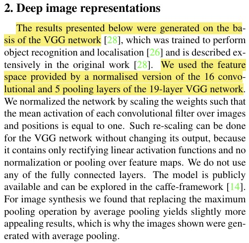
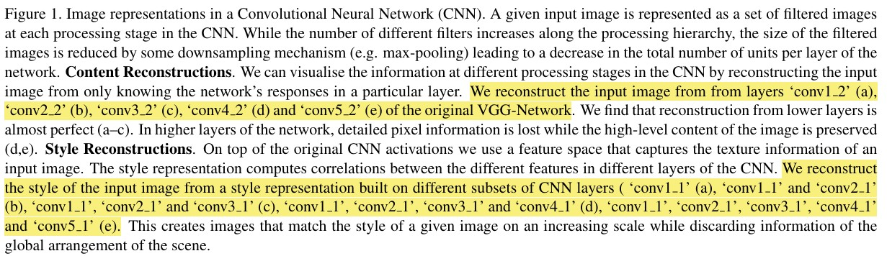

## 🧠논문 구현: Image Style Transfer Using Convolutional Neural Networks

  

논문 링크: https://arxiv.org/abs/1508.06576

발표 학회/연도: CVPR 2016 (IEEE Conference on Computer Vision and Pattern Recognition)

논문 저자: Leon A. Gatys, Alexander S. Ecker, Matthias Bethge

----------
### Overview

위 논문에서는 CNN을 이용하여 사진에서 content와 style을 추출해내 새로운 이미지를 생성하는 방식을 소개하였습니다

처음으로 논문을 구현해보았습니다 논문을 읽고 이해하며 그것을 코드로 옮기는데까지 많은 시간이 걸린 것 같습니다 첫번째로 구조를 나누는 것에 대해 고민했습니다
- `models.py` : 논문에 나온 아키텍처 구현  
- `loss.py` : style/content loss 구현  
- `train.py` : 전체 학습 루프

관습대로라면 'dataset.py'도 있어야하지만 이번 논문에서는 dataset이라고 하기엔 오로지 content사진1장, style사진 1장만이 필요했기에 포함하지 않았습니다

-----------

## Models.py

<div style="display: flex; align-items: flex-start; margin-bottom: 30px;">
  
  <p>
    논문 2. Deep image representation을 살펴보면  
    저자는 <strong>VGG19 model</strong>을 사용했다고 했습니다.  
    그중에서도 <strong>feature map</strong>을 사용한 것을 알 수 있습니다.
  </p>
</div>

<div style="display: flex; align-items: flex-start;">
  
  <p>
    어떤 피쳐맵을 사용했는지 궁금해질 무렵,  
    Figure 1에서 <code>conv(a)_(b)</code>와 같은 말이 나오는데,  
    VGG19 구조를 참고하면 그 의미를 이해할 수 있습니다.
  </p>
</div>

<div style="display: flex; align-items: flex-start;">
  
</div>

conv(a)_(b)는 저자가 특정 conv 레이어 위치를 명시하는 방식으로  
- `a` : 블록번호(VGG에서 max pooling으로 나누니 블록들)  
- `b` : 그 블록 안에서의 conv레이어 순서  

라는걸 알 수 있었습니다

```ptyhon
conv = {
    'conv1_1' : 0, #style featuremap layer 
    'conv2_1' : 5, #style featuremap layer 
    'conv3_1' : 10, #style featuremap layer 
    'conv4_1' : 19, #style featuremap layer 
    'conv5_1' : 28, #style featuremap layer 
    'conv4_2' : 21, #content featuremap layer
}
```
그래서 다음과 같이 conv layer를 정리하였고 vgg19를 통과하다가 conv를 만나게되면 해당 feature map을 가져올 수 있도록 코드를 제작하였습니다

아래는 'models.py' 결과물입니다
```ptyhon
#import
import torch
import torch.nn as nn
from torchvision.models import vgg19

conv = {
    'conv1_1' : 0, #style featuremap layer 
    'conv2_1' : 5, #style featuremap layer 
    'conv3_1' : 10, #style featuremap layer 
    'conv4_1' : 19, #style featuremap layer 
    'conv5_1' : 28, #style featuremap layer 
    'conv4_2' : 21, #content featuremap layer
}

#model 만들기
class StyleTransfer(nn.Module):
    def __init__(self,):
        super(StyleTransfer, self).__init__()
        #TODO: VGG19 load
        self.vgg19_model = vgg19(pretrained = True)
        self.vgg19_features = self.vgg19_model.features

        #TODO: conv layer 분리
        self.style_layer = [conv['conv1_1'], conv['conv2_1'], conv['conv3_1'], conv['conv4_1'], conv['conv5_1']]
        self.content_layer = [conv['conv4_2']]

        pass

    def forward(self, x, mode:str):
        #TODO : style, content마다 conv layer slicing해서 사용하기
        features = []

        if mode == 'style':
            for i in range(len(self.vgg19_features)):
                x = self.vgg19_features[i](x)
                if i in self.style_layer:
                    features.append(x)

        if mode == 'content':
            for i in range(len(self.vgg19_features)):
                x = self.vgg19_features[i](x)
                if i in self.content_layer:
                    features.append(x)

        return features
```

----------

## loss.py

다음으로는 loss를 구현했습니다


----------

## 성능비교

