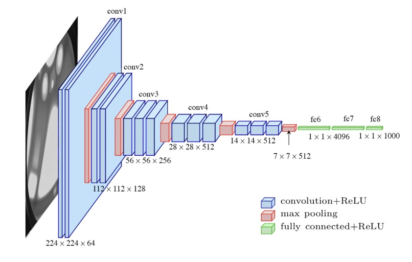
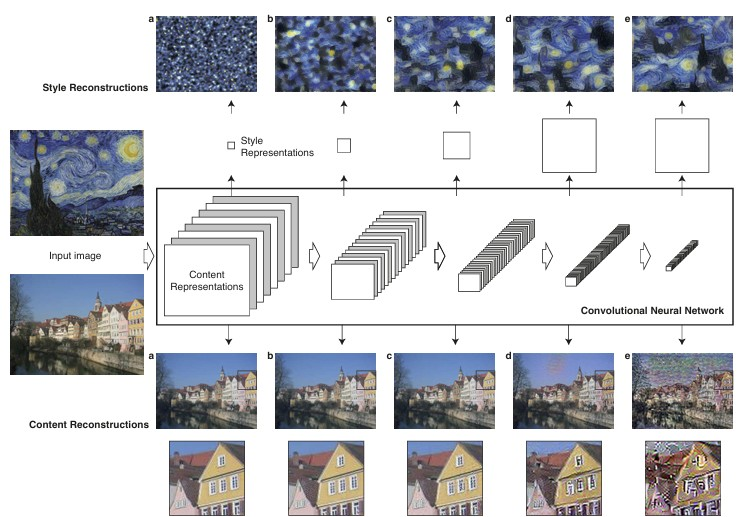

# 🧠논문 구현: Image Style Transfer Using Convolutional Neural Networks

  

논문 링크: https://arxiv.org/abs/1508.06576

발표 학회/연도: CVPR 2016 (IEEE Conference on Computer Vision and Pattern Recognition)

논문 저자: Leon A. Gatys, Alexander S. Ecker, Matthias Bethge

------
### Overview

위 논문에서는 CNN을 이용하여 사진에서 content와 style을 추출해내 새로운 이미지를 생성하는 방식을 소개하였습니다

처음으로 논문을 구현해보았습니다 논문을 읽고 이해하며 그것을 코드로 옮기는데까지 많은 시간이 걸린 것 같습니다 첫번째로 구조를 나누는 것에 대해 고민했습니다
- `models.py` : 논문에 나온 아키텍처 구현  
- `loss.py` : style/content loss 구현  
- `train.py` : 전체 학습 루프

관습대로라면 'dataset.py'도 있어야하지만 이번 논문에서는 dataset이라고 하기엔 오로지 content사진1장, style사진 1장만이 필요했기에 포함하지 않았습니다  
추가로 이 논문을 review하기로 한 이유는 논문을 구현한뒤 결과물이 한 눈에 보이며 cnn을 이용하여 추상적의미인 style을 구현해냈다는 점이 매우 흥미로웠기에 선택하게 되었습니다

-----------

## Models.py

논문 2. Deep image representation을 살펴보면  
>**"The results presented below were generated on the ba
sis of the VGG network"**  
>-[Gatys et al., Image Style Transfer Using CNNs, CVPR 2016]

>**"We used the feature
 space provided by a normalised version of the 16 convo
lutional and 5 pooling layers of the 19-layer VGG network"**  
>-[Gatys et al., Image Style Transfer Using CNNs, CVPR 2016]

저자는 <strong>VGG19 model</strong>을 사용했다고 했습니다.
그중에서도 <strong>feature map</strong>을 중요하게 사용한 것을 알 수 있습니다.

>**"We reconstruct the input image from from layers ‘conv1 2’ (a),
 ‘conv2 2’ (b), ‘conv3 2’ (c), ‘conv4 2’ (d) and ‘conv5 2’ (e) of the original VGG-Network.k"**  
>-[Gatys et al., Image Style Transfer Using CNNs, CVPR 2016]

>**" We reconstruct
 the style of the input image from a style representation built on different subsets of CNN layers ( ‘conv1 1’ (a), ‘conv1 1’ and ‘conv2 1’
 (b), ‘conv1 1’, ‘conv2 1’ and ‘conv3 1’ (c), ‘conv1 1’, ‘conv2 1’, ‘conv3 1’ and ‘conv4 1’ (d), ‘conv1 1’, ‘conv2 1’, ‘conv3 1’, ‘conv4 1’
 and ‘conv5 1’ (e)"**  
>-[Gatys et al., Image Style Transfer Using CNNs, CVPR 2016]

어떤 피쳐맵을 사용했는지 궁금해질 무렵, 논문 속 위 문장에서 <code>conv(a)_(b)</code>와 같은 말이 나오는데, VGG19 구조를 참고하면 그 의미를 이해할 수 있습니다.

<div style="display: flex; align-items: flex-start;">
  
</div>

conv(a)_(b)는 저자가 특정 conv 레이어 위치를 명시하는 방식으로  
- `a` : 블록번호(VGG에서 max pooling으로 나누니 블록들)  
- `b` : 그 블록 안에서의 conv레이어 순서  

라는걸 알 수 있었습니다

그래서 저는 style사진에서 conv1_1, conv2_1, conv3_1, conv4_1, conv5_1을, content사진에서 conv4_2를 사용하였습니다 pytorch vgg19모델에서 다음과 같이 conv layer를 정리하였고 vgg19를 통과하다가 워원하는 conv를 만나게되면 해당 feature map을 가져올 수 있도록 코드를 제작하였습니다

```ptyhon
conv = {
    'conv1_1' : 0, #style featuremap layer 
    'conv2_1' : 5, #style featuremap layer 
    'conv3_1' : 10, #style featuremap layer 
    'conv4_1' : 19, #style featuremap layer 
    'conv5_1' : 28, #style featuremap layer 
    'conv4_2' : 21, #content featuremap layer
}
```

### Why CNN?

<div style="display: flex; align-items: flex-start;">
  
</div>
-[Gatys et al., Image Style Transfer Using CNNs, CVPR 2016]
<br><br><br>

그리고 이 사진과 함께 글에서 cnn을 사용한 이유를 들을 수 있었습니다  <br>

>**We find that reconstruction from lower layers is
 almost perfect (a–c). In higher layers of the network, detailed pixel information is lost while the high-level content of the image is preserved(d,e)**  
>-[Gatys et al., Image Style Transfer Using CNNs, CVPR 2016]

>**This creates images that match the style of a given image on an increasing scale while discarding information of the global arrangement of the scene.**  
>-[Gatys et al., Image Style Transfer Using CNNs, CVPR 2016]

content를 뽑기위해 cnn을 사용함으로써 high-level에서 세부적인 픽셀정보가 손실되지만 이미지의 고수준 내용을 보존해냈고  
style은 cnn을 사용함으롰 주어진 이미지의 스타일을 점점 더 큰 스케일에서 일치시키는 이미지를 만들어내, 장면의 전체 구성에 대한 정보를 제함으로써 style을 뽑아낼 수 있었습니다  
이렇게 cnn이 content와 style을 뽑아냈기에 이러한 논문이 나올 수 있었지 않았나 생각됩니다
<br><br><br>

### 앞선 내용을 바탕으로 수도코드 만들기

```python
class StyleTransfer:

    초기화할 때:
        VGG19 모델 불러옴 (pretrained)
        VGG19에서 feature 추출 부분만 뽑음
        스타일 추출에 쓸 conv 레이어 번호들 정함 (예: conv1_1, conv2_1 ...)
        컨텐츠 추출에 쓸 conv 레이어 번호 정함 (예: conv4_2)

    forward 함수 (이미지, 모드):
        features라는 빈 리스트 만듦

        만약 모드가 'style'이면:
            VGG19 레이어를 차례대로 지나가면서
                현재 레이어 번호가 스타일 레이어 목록에 있으면
                    해당 레이어 출력값을 features에 추가

        만약 모드가 'content'이면:
            VGG19 레이어를 차례대로 지나가면서
                현재 레이어 번호가 컨텐츠 레이어 목록에 있으면
                    해당 레이어 출력값을 features에 추가

        최종적으로 features 반환
```
<br><br><br>

### model 만들기

```python
#import
import torch
import torch.nn as nn
from torchvision.models import vgg19

conv = {
    'conv1_1' : 0, #style featuremap layer 
    'conv2_1' : 5, #style featuremap layer 
    'conv3_1' : 10, #style featuremap layer 
    'conv4_1' : 19, #style featuremap layer 
    'conv5_1' : 28, #style featuremap layer 
    'conv4_2' : 21, #content featuremap layer
}

class StyleTransfer(nn.Module):
    def __init__(self,):
        super(StyleTransfer, self).__init__()
        #TODO: VGG19 load
        self.vgg19_model = vgg19(pretrained = True)
        self.vgg19_features = self.vgg19_model.features

        #TODO: conv layer 분리
        self.style_layer = [conv['conv1_1'], conv['conv2_1'], conv['conv3_1'], conv['conv4_1'], conv['conv5_1']]
        self.content_layer = [conv['conv4_2']]

        pass

    def forward(self, x, mode:str):
        #TODO : style, content마다 conv layer slicing해서 사용하기
        features = []

        if mode == 'style':
            for i in range(len(self.vgg19_features)):
                x = self.vgg19_features[i](x)
                if i in self.style_layer:
                    features.append(x)

        if mode == 'content':
            for i in range(len(self.vgg19_features)):
                x = self.vgg19_features[i](x)
                if i in self.content_layer:
                    features.append(x)

        return features
```

----------

## loss.py

다음으로는 loss를 구현했습니다


----------

## 성능비교

