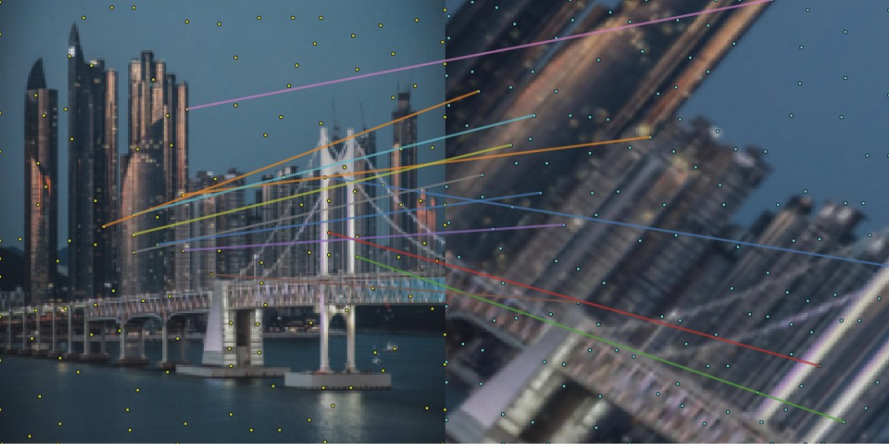
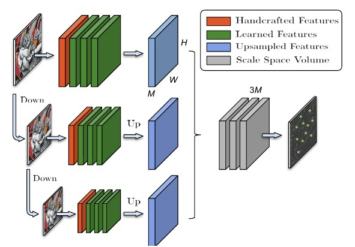
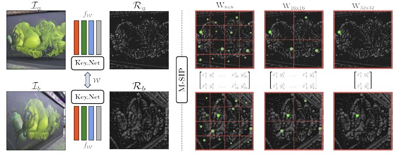
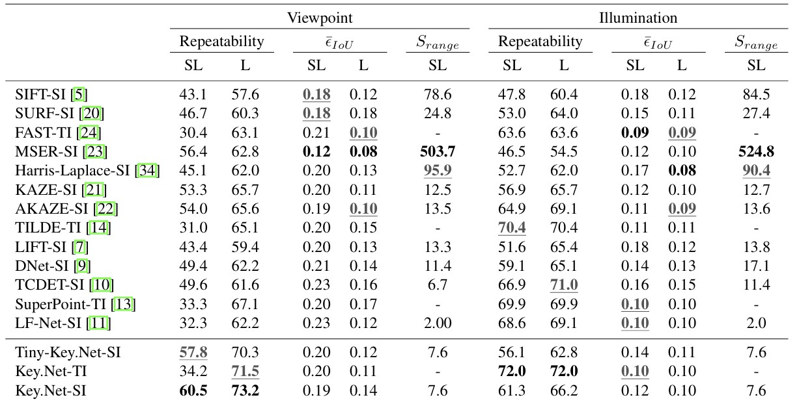
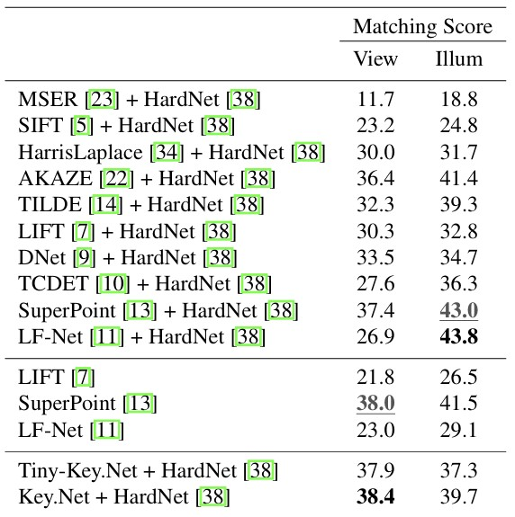
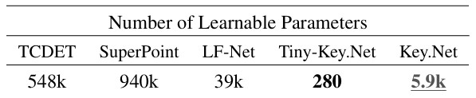

## 📄 논문 정리: Key.Net: Keypoint Detection by Handcrafted and Learned CNN filters

  

> 논문 링크: https://arxiv.org/abs/1508.06576
> 
> 발표 학회/연도: ICCV 2019 (International Conference on Computer Vision 2019)
> 
> 논문 저자: Axel Barroso-Laguna, Edgar Riba, Daniel Ponsa, Krystian Mikolajczyk
 

**해당 논문 선택 이유**  
3d vision을 공부하기로 마음먹고 맨 처음에 무엇을 배워야하냐라고 물어본다면 
저는 wide-baseline matching을 공부해야한다고 생각합니다 그래서 wide-baseline matching중에서
detection분야에서 좋은 성능을 냈었던 KeyNet을 선택하게되었습니다

---

### 이 논문의 핵심 아이디어는 무엇인가?

- **핵심 아이디어** : 수작업(handcrafted) 도함수 필터와 학습된 CNN 필터를 얕은 멀티 스케일 아키텍처 안에서 결합해, 스케일 변화에도 반복성 높은 키포인트를 검출한다 이를 위해 멀티 스케일 인덱스 프로포절 손실로 스케일 전반에 걸쳐 안정적인 특징에 높은 점수를 주도록 학습한다 결과적으로 repeatability/매칭/복잡도에서 최고성능을 끌어냈다

### 이 연구가 중요한 이유는 무엇인가?

- 현실 응용(AR 헤드셋/스마트폰)에서 신뢰성과 효율성을 갖춘 희소(sparse) 로컬 특징 검출기 수요가 커졌지만, detector 쪽에선 학습 방법이 handcrafted 대비 확실한 우위를 보여주지 못했음 → 이 간극을 메우는 시도를 하였기에 중요하다

### 기존 연구들의 한계는 무엇인가?

- 완전 CNN 기반 detector들은 널리 쓰이는 repeatability 지표에서 개선이 제한적이었고, 특징 영역의 아핀 파라미터(특히 스케일) 추정 정확도가 낮다는 문제가 지적되어왔다 한편 커뮤니티는 한동안 희소 검출보다 밀집 표현/매칭에 치우치는 경향이 있었다

### 그 한계를 어떻게 해결하였는가?

- Handcrafted 필터를 ‘약한 앵커(soft anchor)’로 도입해 학습 안정성과 수렴을 높이고 파라미터 수를 대폭 축소하였으며 동시에 CNN 블록이 지역화/점수화/순위를 학습함으로써 해결하였다
- 멀티스케일 피라미드로 입력 3스케일(블러+1.2배 다운샘플)을 병렬 처리하고, 업샘플+컨캣 뒤 최종 컨볼루션으로 response map 산출하였다
- IP(Index Proposal) 레이어로 창(window)별 미분 가능한 soft‑argmax 위치 추출, 그리고 M‑SIP 손실로 다양한 창 크기/스케일에서 공변 제약을 평균해 스케일 전반에 지배적인 키포인트를 학습하도록 유도하였으며 학습은 이미지 간 기하 변환(호모그래피) 만으로 지도하였다

### 제안 방법의 구조는 어떤가?

  

>출처: Axel Barroso-Laguna, Key.Net, ICCV 2019

- 1. 입력: 입력 이미지를 그대로 쓰지않고, 3단계의 스케일 피라미드를 만들었다
  - Level 1 : 원본 이미지
  - Level 2 : 가우시안 블러 + 약 1/1.2 downsampling
  - Level 3 : Level 2 에서 또 downsampling

- 2. Handcrafted 필터
  - 각 스케일 이미지에 대한 핸드크래프트 도함수 필터를 적용하였다
    - 1차 도함수 : $I_x,\, I_y,\, I_x^2,\, I_y^2,\, I_x I_y$
    - 2차 도함수: $I_{xx},\, I_{yy},\, I_{xy},\, I_{xx} I_{yy},\, I_{xy}^2$

- 3. CNN 블럭
  - handcrafted feature map들을 learned convolution block에 투입
  - 구성 : Conv(M개 5 * 5 필터) -> BatchNorm -> ReLU

- 4. Upsampling
  - 각 스케일에서 나온 feature map들을 upsampling함으로써 원본 이미지 크기로 맞추었고 그 다음 concatenate해서 모두 합침으로써 마지막 1개 convolution layer를 거쳐 최종 response map(각 픽셀이 keypoint일 확률)을 생성 

- 5. M-SIP 레이어
  - IP 레어어를 확장해 여러 윈도우 크기를 동시에 사용
  - 작은 윈도우 -> 세밀한 점
  - 큰 윈도우 -> 넓은 문맥에서 안정적인 점
  - 최종 손실 = 각 윈도우 크기에서 계산한 공변 제약 손실의 가중 평균

  

>출처: Axel Barroso-Laguna, Key.Net, ICCV 2019

**요약**
1. 입력 이미지를 3스케일로 변환
2. 각 스케일 → handcrafted 필터링 → CNN 블록 → feature map 생성
3. 모든 feature map을 upsampling 후 concat
4. 마지막 CNN으로 response map 생성
5. response map에서 IP/M-SIP 레이어를 통해 좌표 뽑음
6. NMS로 최종 keypoint 정제

### 어떤 성과를 얻었는가?

  

>출처: Axel Barroso-Laguna, Key.Net, ICCV 2019

- HPatches repeatability(Top-1000, IoU 기준)
  - **Viewpoint**: Key.Net‑SI 60.5/73.2(L/SL), Tiny‑Key.Net‑SI 57.8/70.3, Key.Net‑TI 34.2/71.5. Viewpoint에서는 Key.Net(및 Tiny)이 최상위를 기록하였다
  - **Illumination**: TI 조건에선 Key.Net‑TI가 최고. SI 중에선 L기준 TCDET, SL기준 LF‑Net이 최상을 기록하였다
 

  

>출처: Axel Barroso-Laguna, Key.Net, ICCV 2019

- **매칭 성능(공정비교 위해 전부 HardNet 디스크립터 결합)**: Viewpoint에서 Key.Net이 최고 매칭 스코어를 기록하였다
 

  

>출처: Axel Barroso-Laguna, Key.Net, ICCV 2019

- **파라미터/속도**: SuperPoint 940k vs Key.Net 5.9k, Tiny‑Key.Net 280 파라미터. 600×600 입력에서 Tiny 5.7ms(175 FPS), Key.Net 31ms(32.25 FPS). 적은 파라미터로도 viewpoint repeatability 우수함을 보였다

### 어떤 데이터를 사용했는가?

- **훈련**: ImageNet ILSVRC 2012로부터 합성 데이터이며 랜덤 기하 변환(스케일 0.5–3.5, 스큐 −0.8–0.8, 회전 −60°–60°) 후 대응 영역 추출. 총 12k 쌍(192×192), 9k/3k train/val를 사용하였다

- **평가**: HPatches 전체 이미지 사용(116 시퀀스 = viewpoint 59, illumination 57). 쌍의 공통영역에서 Top‑1000 포인트, IoU<0.4(60% 이상 overlap) 기준으로 매칭/반복성 산출. 스케일 정규화/15×15 NMS 등 프로토콜 준수하였다

### 비판적 사고하기 & 한계점은 무엇인가?
- 1. Detector 전용이라는 아쉬운점이 존재한다 KeyNet은 단순 key point를 검출할뿐이여서 실제 파이프라인에선 SIFT/HardNet과 같은 별로 Descriptor가 필요하다는 한계점이 존재한다
- 2. 학습목표가 "Repeatability"에 편향되어있다 반복 가능한 지점이 항상 잘 구분되는(매칭에 좋은) 지점이 아닐 수 있다는 생각이든다
- 3. 스케일 이외의 방향에 대한 처리가 없다는 한계 또한 존재한다
- 4. KeyNet은 기본적으로 학습시 label이 없기에 기하학적 합성 변환을 줘서 학습시키는데 모든 픽셀이 한 평면 위에 있다는 가정에서만 성립하기에 다른각도에서 본다면에서 한계가 발생한다 

### 한줄 요약 및 개인적 생각
- Detector 연구에서 흔히 “end-to-end로 다 배우자”로 가던 시기에, 오히려 handcrafted가 여전히 가치 있다를 보여준 사례라 인상 깊었으며 “딥러닝이 모든 걸 대체하는 건 아니다, 전통적 아이디어와의 융합이 오히려 강력할 수 있다”를 보여줌으로써 다양하게 공부해야겠다고 생각하였습니다.
