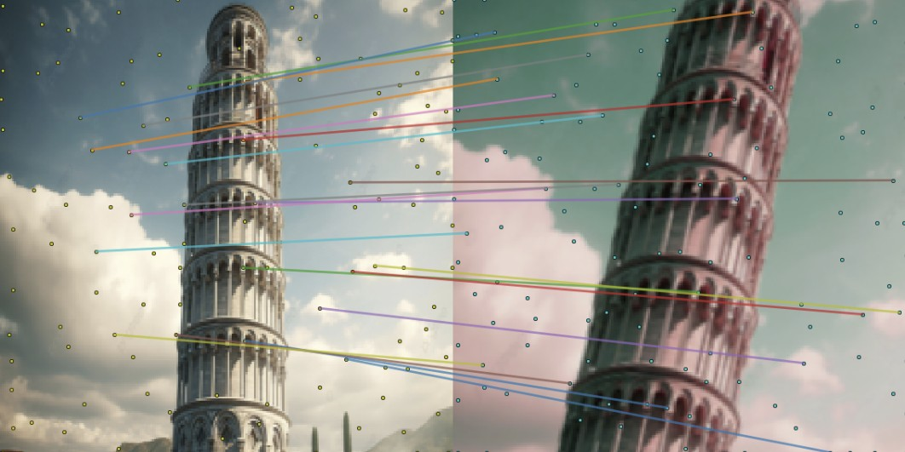

# 🧠논문 구현: KeyNet: Keypoint Detection by Handcrafted and Learned CNN filters

  

논문 링크: https://arxiv.org/abs/1508.06576

발표 학회/연도: ICCV 2019 (International Conference on Computer Vision 2019)

논문 저자: 논문 저자: Axel Barroso-Laguna, Edgar Riba, Daniel Ponsa, Krystian Mikolajczyk

------
### Overview
