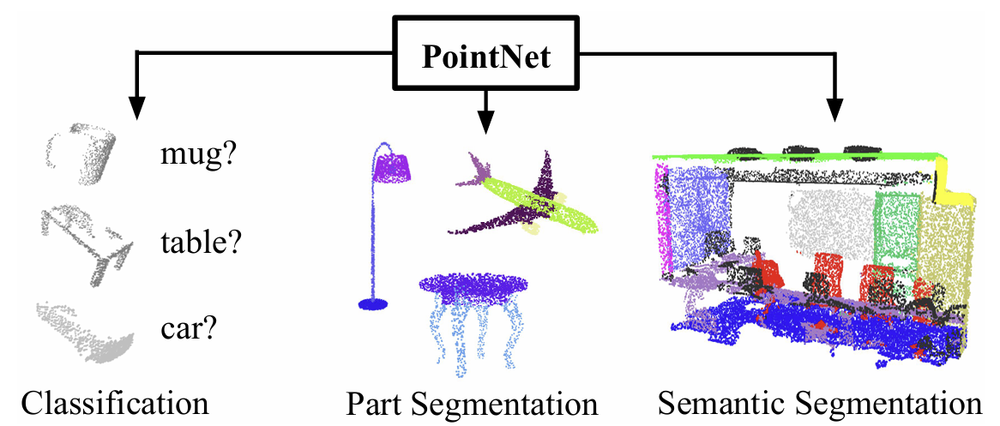
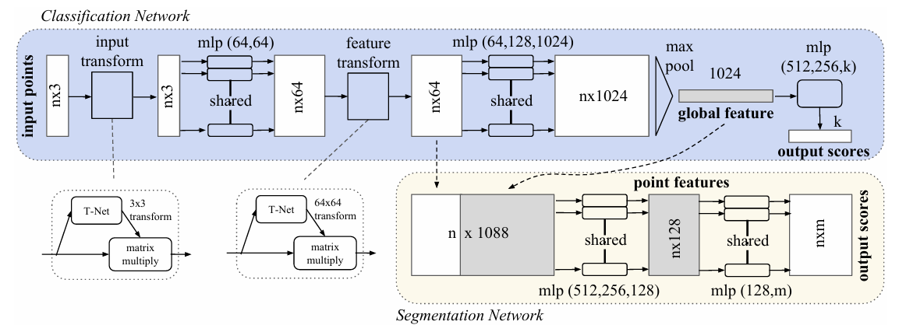
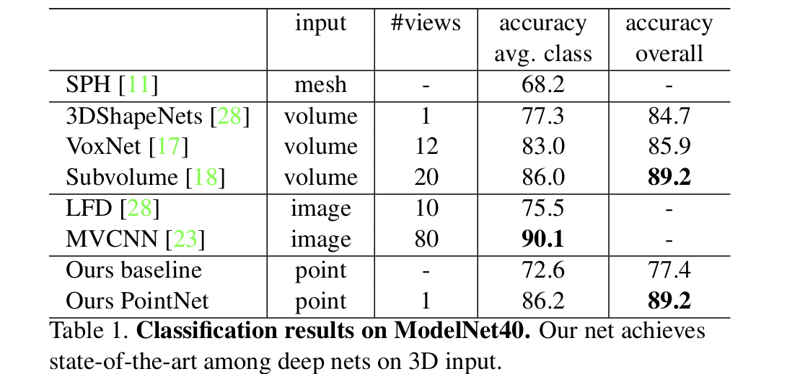

## 📄 논문 정리: PointNet: Deep Learning on Point Sets for 3D Classification and Segmentation

  
<p align="center">
  <span> 출처: Charles R. Qi, PointNet, CVPR 2017 </span>
</p>

> 논문 링크: https://arxiv.org/abs/1612.00593
> 
> 발표 학회/연도: CVPR 2017
> 
> 논문 저자: Charles R. Qi, Hao Su, Kaichun Mo, Leonidas J. Guibas
<br>

**해당 논문 선택 이유**
3D 포인트 클라우드를 voxel이나 multi-view로 변환하지 않고, 원시 점 집합을 그대로 처리하는 단순,효율적 구조를 제안합니다
순서 불변성을 대칭 함수인 max pooling으로 해결하고, **입력/특징 정렬(T-Net)** 로 기하 변환 불변성을 강화하는 방식도한 창의적이였고 
이 단순한 설계로도 기존 접근에 견줄 성능과 높은 효율, 강한 강건성을 보인다는 점이 인상적이어서 선정하게 되었습니다

---

### 이 논문의 핵심 아이디어는 무엇인가?

- 포인트 집합(set) 직접 학습: 3D 포인트 클라우드를 voxel/multi-view로 변환하지 않고 원시 점들(n×3) 을 그대로 입력으로 사용 입력 순서에 불변하기 위해 대칭 함수인 max pooling 으로 전역 특징을 잡아냈다
- Local + Global 결합: 세분화에서는 포인트별 지역 특징에 전역 특징을 concat하여 국소 기하 + 전역 문맥을 동시에 반영
- T-Net 정렬: 입력(3×3)과 특징(64×64)에 대해 소형 네트워크로 affine 정렬을 학습해 회전/이동 등에 변환 불변성을 강화
    
### 이 연구가 중요한 이유는 무엇인가?

- 포인트 클라우드는 로봇/자율주행/AR/3D 재구성에서 핵심 데이터 형식이며 PointNet은 단순 구조로도 빠르고 효율적으로 분류, 파트 세분화, 장면 세그먼테이션을 하나의 프레임워크로 처리하여 속도, 메모리, 강건성에서 좋은 성능을 냈다
  
### 기존 연구들의 한계는 무엇인가?

- Volumetric CNN: 해상도 제약(3D conv 비용, 희소성 문제) --> 고해상도/대규모 포인트 처리 어려움
- Multi-view: 이미지 렌더링으로 세부 기하 포착은 좋지만, 포인트 단위 태스크(포인트 라벨링)로 확장 비자연적
- Graph/Spectral: 메시 제약,범용성 부족 또한 입력 순서 불변성을 직접 다루는 구조가 드묾
  
### 그 한계를 어떻게 해결하였는가?

- 순서 불변성: 공유 MLP로 포인트별 특징을 만들고, max pooling으로 전역 요약
- 변환 불변성: T-Net으로 좌표/특징 공간을 데이터 의존적으로 정렬
- 국소+전역 정보 융합: 세분화에서 전역 특징을 각 포인트에 브로드캐스트하여 컨텍스트-어웨어 포인트 분류 달성
  
### 제안 방법의 구조는 어떤가?

<p align="center">
  <br>
  <span> 출처: Charles R. Qi, PointNet, CVPR 2017 </span>
</p>

Classification
- (n×3 포인트) → 공유 MLP(64,64,64 → 128,1024) → MaxPool(1024-D) → FC(512,256, k) → 클래스 점수

Segmentation
- 포인트별 지역 특징(예: 64-D) + 전역(1024-D) concat → point-wise MLP → (n×m) 점수

Alignment
- 입력 3×3 / 특징 64×64 T-Net으로 정렬

### 어떤 성과를 얻었는가?

<p align="center">
  <br>
  <span> 출처: Charles R. Qi, PointNet, CVPR 2017 </span>
</p>

- ModelNet40 분류: 3D 입력 기반 방법들 대비 경쟁력 있는 정확도와 압도적 효율성(FLOPs/파라미터 수) 달성
- ShapeNet 파트 세분화 / Stanford 3D 장면 세그멘테이션: 넓은 범주에서 state-of-the-art 수준 mIoU/정확도, 부분 스캔에서도 강건
- 효율성: MVCNN/3D CNN 대비 수십~수백 배 낮은 FLOPs 및 적은 파라미터로 실시간 응용 가능성 제시
  
### 어떤 데이터를 사용했는가?

- ModelNet40: 40개 물체 카테고리 CAD 모델
- ShapeNet Part: 16개 카테고리, 50개 파트 라벨(포인트 단위 mIoU 평가)
- Stanford 3D Semantic Parsing: 실내 스캔, 13 클래스(장면 세그멘테이션)

  
### 비판적 읽기 & 한계점은 무엇인가?

- 장점
  - 단순성+일관성: 하나의 구조로 분류/세분화 모두 처리
  - 강건성: 임계점 기반 요약으로 잡음/결측/순서 변화에 강함
  - 효율성: 메모리/연산량 절감 → 실시간성에 유리

- 한계
  - 지역 구조 학습의 한계: 이웃을 찾는 부분이 약해 지역적 구조 학습에 아쉬웠음
  - 미세 기하 디테일: 멀티뷰 렌더링 대비 세부 기하 포착이 부족할 수 있음

- 개인적 생각
  - vexel 이외에 point cloud라는 데이터를 사용하여 빠르고 간편하게 classification을 했다는점에서 이후 연구들의 선구자이지 않았나 생각이된다

### 직관적으로 구조 이해하기

```python
# Forward-only (분류)
Points (B,N,3)
  -> T-Net(3x3) 정렬
  -> Shared MLP: (3→64→64→64→128→1024) on each point
  -> Max Pool over N: global 1024-D
  -> FC Head: (512→256→K)
  -> logits (B,K), argmax
```
