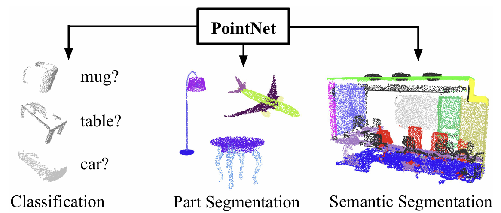

## 📄 논문 구현: PointNet: Deep Learning on Point Sets for 3D Classification and Segmentation

  
<p align="center">
  <span> 출처: Charles R. Qi, PointNet, CVPR 2017 </span>
</p>

> 논문 링크: https://arxiv.org/abs/1612.00593
> 
> 발표 학회/연도: CVPR 2017
> 
> 논문 저자: Charles R. Qi, Hao Su, Kaichun Mo, Leonidas J. Guibas
<br>

---

### Overview

이 리포는 PointNet (classification 전용) 아이디어를 최소 코드로 재구성한 구조체입니다
실제 데이터셋 없이 torch.randn()로 만든 가짜 point cloud를 넣어 파이프라인 흐름(입력/특징 정렬 T-Net → 공유 MLP → Max Pooling → FC Head) 만 빠르게 검증하도록 설계했습니다

구현 관점에서, 구조를 다음처럼 나눴습니다
- `models/` : PointNet 분류 헤드와 T-Net(3×3, 64×64) 모듈
- `demo_cls.py` : 학습 없이 랜덤 포인트로 forward만 돌려 (B,K) logits과 argmax 예측 확인
- `requirements.txt` : 미니멀 의존성 (PyTorch만)

Dataset과 config는 포함하지 않았습니다. 본 스켈레톤은 구조만 빠르게 검증하기 위함입니다.

---

### File Tree

```pthon
구현/
├─ models/
│  ├─ pointnet_cls.py      # PointNet classification: (B,N,3) -> (B,K)
│  └─ tnet.py              # T-Net (3x3, 64x64) 입력/특징 정렬 모듈
├─ demo_cls.py             # 랜덤 포인트로 forward 데모 (학습 없음)
├─ requirements.txt        # torch 만으로 충분
└─ README.md
```

---
### Components

1. `models/pointnet_cls.py`
   - **목적**: 원시 point cloud를 입력받아 분류 logits (B,K) 출력
   - **구조**: 공유 MLP(64→64→64) → MLP(128→1024) → Max Pooling(global) → FC(512→256→K)
   - **학습**: 이 스켈레톤에서는 학습하지 않고 forward 구조만 시연
     
```python
import torch
import torch.nn as nn
from models.tnet import TNet

class PointNetCls(nn.Module):
    def __init__(self, t = 40):
        super().__init__()
        self.tnet3 = TNet(k=3)
        self.tnet64 = TNet(k=64)

        self.net1 = nn.Sequential(
            nn.Conv1d(3, 64, kernel_size=1, bias=False),
            nn.BatchNorm1d(64),
            nn.ReLU(),
            nn.Conv1d(64, 64, kernel_size=1, bias=False),
            nn.BatchNorm1d(64),
            nn.ReLU(),
            nn.Conv1d(64, 64, kernel_size=1, bias=False),
            nn.BatchNorm1d(64),
            nn.ReLU()    
        )

        self.net2 = nn.Sequential(
            nn.Conv1d(64, 128, kernel_size=1, bias=False),
            nn.BatchNorm1d(128),
            nn.ReLU(),
            nn.Conv1d(128, 1024, kernel_size=1, bias=False),
            nn.BatchNorm1d(1024),
            nn.ReLU()
        )

        self.net3 = nn.Sequential(
            nn.Linear(1024, 512, bias=False),
            nn.BatchNorm1d(512),
            nn.ReLU(),
            nn.Dropout(p=0.3),
            nn.Linear(512, 256, bias=False),
            nn.BatchNorm1d(256),
            nn.ReLU(),
            nn.Dropout(p=0.3),
            nn.Linear(256, t)
        )


    def forward(self, x:torch.Tensor):
        x, T3 = self.tnet3(x)
        x = self.net1(x)
        x, T64 = self.tnet64(x)
        x = self.net2(x)
        x = torch.max(x, dim=2, keepdim = False)[0]
        x = self.net3(x)
        return x
```

<br><br>

2. `models/tnet.py`
   - 역할: T-Net으로 입력/특징의 affine 정렬(3×3, 64×64) 수행
   - 구성: Conv1d … → Global Max → FC → k×k 변환 행렬 산출, torch.bmm으로 적용
  
```python
import torch
import torch.nn as nn
import torch.nn.functional as F

class TNet(nn.Module):
    def __init__(self, k: int = 3):
        super().__init__()
        self.k = k

        self.conv1 = nn.Conv1d(k, 64, kernel_size=1, bias=False)
        self.bn1   = nn.BatchNorm1d(64)

        self.conv2 = nn.Conv1d(64, 128, kernel_size=1, bias=False)
        self.bn2   = nn.BatchNorm1d(128)

        self.conv3 = nn.Conv1d(128, 1024, kernel_size=1, bias=False)
        self.bn3   = nn.BatchNorm1d(1024)

        self.fc1 = nn.Linear(1024, 512, bias=False)
        self.bn4 = nn.BatchNorm1d(512)

        self.fc2 = nn.Linear(512, 256, bias=False)
        self.bn5 = nn.BatchNorm1d(256)

        self.fc3 = nn.Linear(256, k * k)

    def forward(self, x: torch.Tensor):

        B, k, N = x.size()
        assert k == self.k

        out = F.relu(self.bn1(self.conv1(x)))
        out = F.relu(self.bn2(self.conv2(out)))
        out = F.relu(self.bn3(self.conv3(out)))

        out = torch.max(out, dim=2, keepdim=False)[0]

        out = F.relu(self.bn4(self.fc1(out)))
        out = F.relu(self.bn5(self.fc2(out)))
        T   = self.fc3(out).view(B, self.k, self.k)

        x_t = torch.bmm(x.transpose(1, 2), T).transpose(1, 2)
        return x_t, T

def tnet_orthogonal_regularizer(T: torch.Tensor) -> torch.Tensor:
    B, k, _ = T.size()
    I = torch.eye(k, device=T.device).unsqueeze(0).expand(B, -1, -1)
    TT_t = torch.bmm(T, T.transpose(1, 2))
    diff = I - TT_t
    return torch.mean(torch.norm(diff, dim=(1, 2))**2)
```

---
### How to Run

```python
pip install -r requirements.txt
python demo.py
```
- `demo.py`는 다음 순서로 동작합니다
1. (가짜) point cloud 텐서 생성: x ~ torch.randn(B, N, 3)
2. 입력/특징 정렬: T-Net(3×3, 64×64)로 정렬 적용
3. 공유 MLP로 point-wise 특징 추출
4. Max Pooling으로 전역 특징 집계 (순서 불변성)
5. FC Head로 K개 클래스 logits 산출 → argmax로 예측 출력

학습 로직과 데이터셋은 포함하지 않았으며, 구조 검증을 위한 forward-only 데모입니다

---
