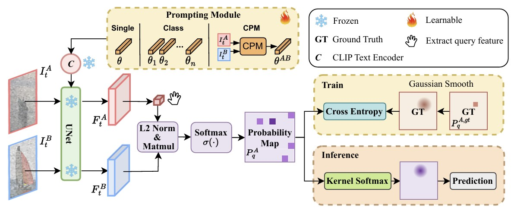

## 📄 논문 정리: SD4Match: Stable Diffusion Features for Semantic Matching
 

   
   출처: https://sd4match.active.vision/

 

> 논문 링크: https://arxiv.org/abs/2403.10516 
> 
> 발표 학회/연도: CVPR 2024
> 
> 논문 저자: Yuan Yao, Zhiwei Xiong, Hang Zhao
 

**해당 논문 선택 이유**

SD4Match는 최신 패러다임을 반영한 논문이였습니다 생성 모델의 표현력이 Matching 태스크에서도 좋은 방식으로 사용될 수 있다는걸 보여준 좋은 논문이기 때문에 본 논문을 선택하여 읽고, 구현하게 되었습니다.

---

### 이 논문의 핵심 아이디어는 무엇인가?
- 생성 모델(Stable Diffusion)의 U-Net 내부 피처를 semantic correspondence에 바로 쓰고, 프롬프트를 학습해 매칭 확률지도(corr map→prob map)가 정답에 피크가 나도록 만든다. Diffusion은 고수준 의미,문맥을 담아 강건한 매칭 피처를 제공한다

### 이 연구가 중요한 이유는 무엇인가?
- 분류,검출용 백본 대신 생성모델 피처를 인식(매칭)에 재활용하는 흐름을 제시하였다 기존 zero-shot SD 기반보다, 간단한 프롬프트 튜닝만으로도 큰 향상을 이루어내 생성모델의 잠재력을 매칭에 끌어냈다

### 기존 연구들의 한계는 무엇인가?
- 대부분 연구가 SD에서 텍스트 템플릿 등 고정 프롬프트만 사용하거나, 분류 중심의 프롬프트 연구에 치중해왔다 매칭 문제에 특화된 프롬프트 튜닝은 부재했다 그에따라 본 연구가 최초로 시도하였다고 주장했다

### 그 한계를 어떻게 해결하였는가?
- 프롬프트 모듈을 세 가지로 설계해 매칭에 최적화하였다
    - Single : 모든 쌍에 공통
    - Class : 클래스별
    - CPM : 쌍의 로컬 피처로 조건부 생성
- U-Net 2nd up-block 피처를 사용, corr→softmax(β)→가우시안 스무딩 라벨과 CE로 프롬프트를 학습하였다
- 추론은 Kernel-Softmax로 좌표를 안정적으로 로컬라이즈하였다

### 제안 방법의 구조는 어떤가?

   
   출처: Yuan Yao, SD4Match, CVPR 2024

 
SD4Match의 전체 구조는 Stable Diffusion 2.1의 백본(VAE + U-Net + Scheduler)과, 그 위에 얹힌 Prompt Learning 모듈 및 Correlation + Loss 계산 과정으로 이루어진다. 학습 시에는 백본 파라미터는 동결(freeze)하고, 오직 프롬프트 파라미터만 업데이트한다. 알고리즘은 크게 1. 입력 전처리 및 프롬프트 생성, 2. Diffusion 백본을 통한 피처 추출, 3. 상관관계 행렬(correlation map) 계산, 4. 확률 분포 변환 및 손실 계산 단계로 진행된다.

1. **입력 및 프롬프트 생성**
   
    - 입력: 두장의 이미지 $`\mathcal{I}_{\text{A}}`$,$`\mathcal{I}_{\text{B}}`$
    - 프롬프트 생성 방식은 세 가지 모드로 제공된다
      1. **Single Prompt** : 모든 이미지 쌍에서 동일하게 사용하는 하나의 learnable embedding.
      2. **Class Prompt** : 클래스별로 독립적인 임베딩을 학습. 쌍의 클래스 id에 따라 적절한 프롬프트를 선택.
      3. **Conditional Prompt Module (CPM)** : 이미지 쌍 자체의 로컬 피처(DINOv2 backbone으로 추출)를 사용해 프롬프트를 조건부 생성한다 이 경우, DINOv2 피처 → projection layer(g_d, g_n) → adaptive pooling → learnable weight + positional embedding → global prompt와 concat한
    - 결과적으로 이 단계에서 얻어지는 출력은 프롬프트 임베딩 (𝐵,𝑁,𝐷) (B=batch, N=프롬프트 토큰 수, D=hidden dim=1024)

2. **Stable Diffusion 백본을 통한 피처 추출**

    - Stable Diffusion 2.1의 VAE를 통해 이미지를 latent 공간으로 압축

$$
z = \text{VAE}(I), \quad z \in \mathbb{R}^{B \times 4 \times H/8 \times W/8}
$$
  
&nbsp;&nbsp;&nbsp;&nbsp;&nbsp;&nbsp;&nbsp;&nbsp;&nbsp;&nbsp;&nbsp;&nbsp;Scheduler를 이용해 timestep 𝑡에서 노이즈를 추가

$$
z_t = \sqrt{\alpha_t}\, z + \sqrt{1-\alpha_t}\, \epsilon
$$

&nbsp;&nbsp;&nbsp;&nbsp;&nbsp;&nbsp;&nbsp;&nbsp;&nbsp;&nbsp;&nbsp;&nbsp;SchedulerU-Net에 $`\mathcal{Z}_{\text{t}}`$ 와 prompt embedding을 넣어 forward한다  
&nbsp;&nbsp;&nbsp;&nbsp;&nbsp;&nbsp;&nbsp;&nbsp;&nbsp;&nbsp;&nbsp;&nbsp;U-Net의 여러 블록 중, 2nd up-block의 마지막 ResNet layer 출력을 hook으로 받아 feature map으로 사용한다  
&nbsp;&nbsp;&nbsp;&nbsp;&nbsp;&nbsp;&nbsp;&nbsp;&nbsp;&nbsp;&nbsp;&nbsp;이 feature map은 채널 방향으로 L2 정규화되어 semantic descriptor 역할을 한다  
  
3. **Correlation Map 계산**
    - 두 feature map을 채널 차원에서 내적하여 모든 위치 쌍의 유사도를 계산한다

$$
\text{corr}[i,j] = \langle F_A[:, i], \; F_B[:, j] \rangle
$$

$$
\text{corr} \in \mathbb{R}^{B \times HW_A \times HW_B}
$$

&nbsp;&nbsp;&nbsp;&nbsp;&nbsp;&nbsp;&nbsp;&nbsp;&nbsp;&nbsp;&nbsp;&nbsp;구현에서는 flatten하여 (B, HW_A, HW_B) 형태의 2D 행렬로 계산한다  
&nbsp;&nbsp;&nbsp;&nbsp;&nbsp;&nbsp;&nbsp;&nbsp;&nbsp;&nbsp;&nbsp;&nbsp;이렇게 만들어진 correlation map은 “A의 한 픽셀이 B의 모든 픽셀과 얼마나 유사한가”를 나타내는 거대한 유사도 행렬  

4. **확률 변환 및 손실 계산**
   - corr map은 raw similarity이므로 확률로 해석하기 위해 temperature softmax를 적용

$$
P = \text{softmax}\!\left(\frac{\text{corr}}{\beta}, \; \text{dim}=-1\right), 
\quad \beta = 0.04
$$

&nbsp;&nbsp;&nbsp;&nbsp;&nbsp;&nbsp;&nbsp;&nbsp;&nbsp;&nbsp;&nbsp;&nbsp;Ground-truth keypoints를 feature map 크기에 맞게 스케일링 후, _coords_to_linidx로 flatten 인덱스로 변환한다  
&nbsp;&nbsp;&nbsp;&nbsp;&nbsp;&nbsp;&nbsp;&nbsp;&nbsp;&nbsp;&nbsp;&nbsp;softmax 결과 𝑃에서 해당 쿼리 인덱스 행만 추출한다  
&nbsp;&nbsp;&nbsp;&nbsp;&nbsp;&nbsp;&nbsp;&nbsp;&nbsp;&nbsp;&nbsp;&nbsp;GT 타깃은 one-hot이 아니라, _make_gaussian_targets로 중심좌표 주변에 가우시안 분포를 준 soft label 𝐺  
&nbsp;&nbsp;&nbsp;&nbsp;&nbsp;&nbsp;&nbsp;&nbsp;&nbsp;&nbsp;&nbsp;&nbsp;손실: Cross Entropy  

$$
\mathcal{L} = -\frac{1}{N} \sum_{n=1}^N 
\sum_{u=1}^{HW_B} G_{n,u} \; \log \big( P_{\text{sel},n,u} \big)
$$

5. ** 추론 시 매칭 추출**
    - 학습된 프롬프트를 이용해 corr map 계산 후 softmax
    - argmax로 단일 대응을 뽑는 대신, kernel-softargmax로 확률의 기대값을 계산해 더 부드럽고 안정적인 좌표를 추론
    - 최종적으로 A의 키포인트에 대응하는 B의 좌표를 얻는다
  
**요약**  

즉, SD4Match의 구조는 Stable Diffusion의 feature를 semantic correspondence에 최적화된 방식으로 추출하고, 프롬프트를 학습해 corr map의 확률 분포가 GT correspondence에 피크를 형성하도록 CE loss로 학습하는 구조이다 프롬프트는 single/class/conditional 방식으로 유연하게 바꿀 수 있고, inference에서는 soft-argmax를 써서 매칭 좌표를 얻는다

### 어떤 성과를 얻었는가?

### 어떤 데이터를 사용했는가?
### 비판적 읽기 & 한계점은 무엇인가?
### 한줄 요약 및 개인적 생각

### 직관적으로 구조 이해하기
### feed forward -> backpropagation 직관적 이해하기
### 궁금했던 부분
