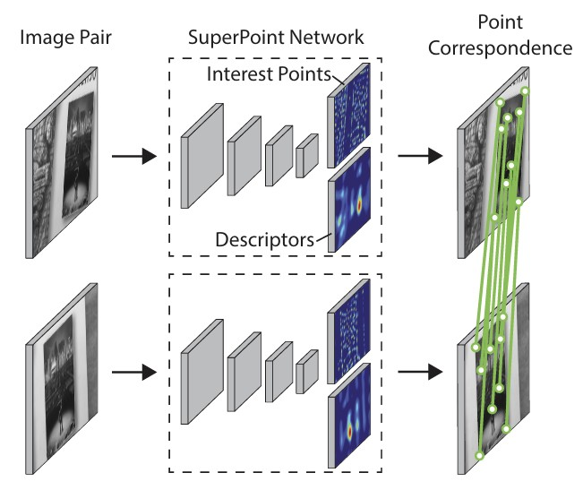
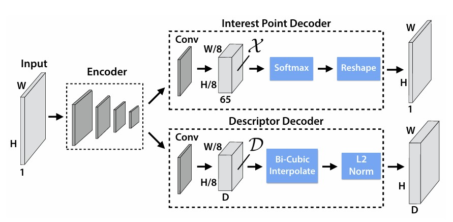

## 📄 논문 정리: SuperPoint: Self-Supervised Interest Point Detection and Description

  

> 논문 링크: https://arxiv.org/abs/1712.07629v4
> 
> 발표 학회/연도: CVPR 2018 Workshops
> 
> 논문 저자: Daniel DeTone, Tomasz Malisiewicz, Andrew Rabinovich (Magic Leap).
 

**해당 논문 선택 이유**
- SuperPoint는 로컬 피처 학습 계열(Detector-Free, Dense Matching, Graph Matching 등)에서 사실상 근본으로 평가받는다고 들었따 이후 나온 D2-Net, R2D2, SuperGlue 같은 최신 기법들을 이해하려면 SuperPoint의 아이디어와 한계를 먼저 파악하는 것이 필수적이라 생각되었기에 해당 논문을 선택하게되었다

---

### 이 논문의 핵심 아이디어는 무엇인가?
- 공유 인코더 + 멀티헤드 구조 : 하나의 CNN 인코더에서 두 개의 헤드(Detector, Descriptor)를 동시에 학습했다 그럼으로써 네트워크 한 번의 forward만으로 keypoint와 descriptor를 동시에 얻었다

### 이 연구가 중요한 이유는 무엇인가?
- 라벨링 어려운 로컬 코너 문제를 대규모 인공지능으로 풀 수 있게 하였다(합성→실사 도메인 적응)
- 완전 합성곱+공유 인코더라 한 번의 forward로 키포인트와 디스크립터를 동시에쓸 수 있는 구조를 가짐으로써 실시간으로 사용가능하다

### 기존 연구들의 한계는 무엇인가?
- 핸드크래프트(SIFT/ORB)는 detect-then-describe로 단계가 분리되고, 깊은 표현이 없다
- LIFT는 엔드투엔드지만 SfM 기반의 강한 감독에 의존하고 패치 기반이라 효율이 떨어진다
- UCN/DeepDesc류는 디스크립터만 학습, 검출은 못함한다 SuperPoint는 “풀 이미지 입력, 단일 네트워크, 실시간” 조건을 동시 만족하는 유일한 방법으로 정리되었다(논문 Table 1)

### 그 한계를 어떻게 해결하였는가?
- 완전공유 인코더+두 개의 디코더 헤드(검출/서술)로 계산을 공유하였함으로써 학습표현과 실시간, 효율, 성능문제를 해결하였다

### 제안 방법의 구조는 어떤가?

  

- 1. 공유 Encoder
      1. 구조 : 기본적 구조는 VGG style CNN
      2. 구성 : 3×3 Conv + ReLU 블록 × 8, 중간에 2×2 MaxPooling × 3
      3. 출력 : 입력 이미지의 1/8 해상도 feature map, 채널 수 128
- 2. Detector Head
      1. 입력 : (H/8, W/8, 128) feature map
      2. 구성 : 3×3 Conv (256) → 1×1 Conv (65) → Softmax
      3. 출력 : (H/8, W/8, 65)
         - 64개 채널 : 각 8×8 셀 내 픽셀 위치
         - 1개 채널 : dustbin(배경)
      4. 후처리 : pixel-shuffle로 H×W 크기 확률맵 복원 → NMS(Non-Max Suppression) 적용
- 3. Descriptor Head
      1. 입력: (H/8, W/8, 128) feature map
      2. 구성 : 3×3 Conv (256) → 1×1 Conv (256)
      3. 출력 : (H/8, W/8, 256) dense descriptor map
      4. 추출 방식:
          - keypoint 좌표를 1/8로 스케일링
          - bilinear interpolation으로 descriptor 추출
          - L2 정규화하여 단위 벡터로 변환
        
- 요약  
1. 인코더: VGG-style CNN, 입력을 1/8 해상도로 압축  
2. 검출기 헤드: 65채널 softmax, pixel-shuffle로 확률맵 복원  
3. 서술자 헤드: 256차원 dense descriptor map  
4. 학습 전략: Synthetic Shapes → Homographic Adaptation → Joint training  
5. 특징: 한 번의 forward로 keypoint와 descriptor를 동시에 추출, 실시간(~70 FPS) 가능
 
### 어떤 성과를 얻었는가?
- HPatches 반복성(Repeatability, 300점, ε=3px): 조명변화에서 SuperPoint 0.652(NMS=4)로 최고, 시점변화에서도 경쟁력을 들어냈다
- HPatches 호모그래피 정확도: ε=3px 정확도 0.684(SuperPoint)로 LIFT(0.598), ORB(0.395)보다 우수, SIFT(0.676)와 비슷하며 디스크립터 NN mAP도 0.821로 높았다

### 어떤 데이터를 사용했는가?
- Synthetic Shapes(삼각형/사각형/선/타원/체커보드/별 등) 합성·온더플라이 렌더 → MagicPoint 학습했다 (public 공개O)
- MS-COCO 2014 train(8만 장, 240×320, 그레이스케일)에서 Homographic Adaptation으로 pseudo-GT 생성했다 (public 공개X)

### 비판적 읽기 & 한계점은 무엇인가?
- 학습 과정에서 사용하는 self-supervision은 호모그래피 변환에 기반한다. 이는 평면 근사나 작은 시점 변화에는 적합하지만, 3D 비평면 구조, 극단적인 시점 이동 상황에서는 약하다. 따라서 실제 복잡한 환경에서 일반화에 한계가 있을 것으로 보인다
- Homographic Adaptation으로 얻은 pseudo-GT는 반복성이 높을 수는 있으나, 여전히 노이즈 라벨이 포함된다는 한계점이 보인다

### 한줄 요약 및 개인적 생각
- SuperPoint는 합성 데이터 + self-supervision으로 라벨링 문제를 해결하고, 하나의 네트워크로 검출과 서술을 동시에 수행하여 실시간 성능까지 달성한 모델이며 이 논문은 구조적으로는 단순하지만, “라벨 부족 문제를 self-supervised 학습으로 해결한다”는 아이디어 자체가 굉장히 창의적이다
